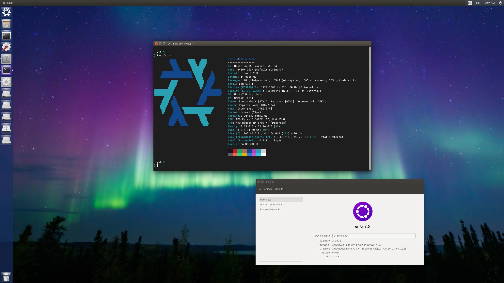

# Unity on Nix

> Bring the Unity 7 desktop to NixOS, without turning NixOS into Ubuntu.

[Unity](https://gitlab.com/ubuntu-unity/unity/unity) is one of the most
distinctive desktop environments Linux has produced: a focused launcher, a
search-first Dash, a global menu, the HUD, useful keyboard navigation, and a
layout that treats screen space as something worth preserving. It remains a
great desktop paradigm, but using it has historically meant using Ubuntu.

This project is changing that. `unity-on-nix` packages the Unity 7 desktop and
its supporting services as a standalone flake and NixOS module. The goal is a
complete, reproducible Unity experience that can be enabled from any NixOS
flake like any other desktop environment.

The port is maintained out of tree from Nixpkgs and does not replace packages
or modify a system until its module is imported and enabled.

## Project status

> [!WARNING]
> This is an active port, not yet a release-ready daily desktop. Keep another
> working desktop session available while testing it.

Unity itself builds and runs. The current port has reached real graphical
logins through LightDM and renders the Unity shell, launcher, panel, Dash, and
desktop. The session also starts HUD, indicators, BAMF application matching,
input methods, settings services, and the GTK desktop portal.



The screenshot shows the current desktop running on NixOS with the Unity
launcher, Dash, GNOME Terminal, Unity Control Center, NixOS branding, and
Ubuntu wallpapers.

We are now working through the less glamorous but essential integration work:
reliable application launching and discovery, theme and icon fidelity, global
menus, local scopes, locking, logout, and hardware behavior. Build success and
runtime verification are tracked separately so the project does not claim a
feature merely because it compiles.

Current target: **x86_64-linux on X11**. We intend to investigate a Wayland
session after the X11 implementation is complete, polished, and dependable.

## Try it

Add the repository to your flake inputs:

```nix
{
  inputs = {
    nixpkgs.url = "github:NixOS/nixpkgs/nixos-unstable";

    unity-on-nix = {
      url = "github:soltros/unity-on-nix";
      inputs.nixpkgs.follows = "nixpkgs";
    };
  };
}
```

Import the module in your NixOS configuration:

```nix
{
  outputs = { self, nixpkgs, unity-on-nix, ... }@inputs: {
    nixosConfigurations.my-machine = nixpkgs.lib.nixosSystem {
      system = "x86_64-linux";
      specialArgs = { inherit inputs; };

      modules = [
        unity-on-nix.nixosModules.default

        {
          services.desktopManager.unity.enable = true;
        }
      ];
    };
  };
}
```

LightDM and the Unity greeter are enabled by the module. Rebuild, reboot, and
select **Unity** at login:

```sh
sudo nixos-rebuild switch --flake .#my-machine
```

To use another display manager:

```nix
services.desktopManager.unity.lightdm.enable = false;
```

Additional applications can be made part of the Unity desktop environment:

```nix
services.desktopManager.unity.extraPackages = with pkgs; [
  firefox
  libreoffice
];
```

The flake currently validates against the NixOS 26.05 revision recorded in
`flake.lock`. Following another Nixpkgs revision is supported by the interface,
but unstable and other releases may uncover compatibility changes while the
port is young.

After a new `unity-on-nix` revision is published, update an existing consumer
flake with:

```sh
nix flake lock --update-input unity-on-nix
```

## What is included

| Area | Components |
| --- | --- |
| Desktop shell | Unity 7.7.1, launcher, Dash, panel, window decorations, lock screen |
| Compositor | Compiz 0.9.14.2 and Nux 4.0.8 |
| Login | LightDM with the Unity greeter |
| Settings | Unity Settings Daemon and Unity Control Center |
| Desktop integration | HUD, GTK global-menu module, BAMF, Zeitgeist, notifications |
| Indicators | Applications, global menu, sound, power, session, clock, keyboard, Bluetooth, messages |
| Search | Home, applications, files, music, local video, and Shotwell photo scopes |
| System integration | NetworkManager, PipeWire, polkit, keyring, GVfs, UDisks, UPower, desktop portals |
| Look and feel | Ambiance, Ubuntu icon themes, Unity assets, Ubuntu fonts |

The Cinnamon desktop is not installed. A tailored build of its session manager
and the small shared `cinnamon-desktop` library are used where Unity still needs
those APIs. Cinnamon's shell and settings daemon are excluded; Unity runs its
own shell and settings daemon.

## Test it in a VM

The repository includes an isolated NixOS VM, so development does not require
changing the host desktop:

```sh
nix build path:.#nixosConfigurations.unity-test.config.system.build.vm
./result/bin/run-unity-test-vm
```

The VM boots into the Unity greeter. Log in as `tester` with password
`test-only`. These credentials exist only in the VM. SSH is forwarded to
`127.0.0.1:2222`, and the VM disk is created as `unity-test.qcow2` in the launch
directory. KVM is recommended, although QEMU can fall back to slower software
emulation.

Run the package and integration checks with:

```sh
nix build path:.#unity-session
nix flake check path:.
```

The graphical check starts a software-rendered X11 server, loads Unity through
the real Compiz profile, requires launcher and panel windows, and verifies that
an application window can open. Other checks cover Compiz/Nux interfaces,
module isolation, PAM/session registration, LightDM integration, GTK portal
configuration, and Ubuntu's patched AccountsService API.

Use `path:.` for local work containing uncommitted files. Git-backed flake
evaluation only sees files tracked by Git.

## What had to be ported

Unity is a family of cooperating projects rather than one executable. Making it
work in the Nix store requires more than compiling the shell:

- Ubuntu installation paths and service definitions must become immutable Nix
  store paths.
- Compiz must discover Unity's separately packaged plugins, metadata, and
  profiles.
- GTK needs Ubuntu's Unity extensions for menus and window behavior.
- Indicators, schemas, icons, D-Bus services, and scopes must be assembled into
  a coherent session environment.
- Session services must start in the right order and stop cleanly at logout.
- Ubuntu's AccountsService extensions must coexist with NixOS account-management
  safeguards.
- Older projects need compatibility work for current GCC, GLib, GTK, Boost,
  ICU, PCRE2, CMake, and Qt.

Package recipes pin Ubuntu source versions and hashes in `pkgs/sources.json` and
apply the relevant Debian patch series. Unity itself is pinned to commit
`6f01ccb7395ca0fb3ee5f220263d9704a18ce194`; the session definition is pinned to
`32c2fd569b0d51e40bd3ec875e77f0261a744d03`.

## Known gaps

- Application discovery and launcher behavior are still being hardened across
  real NixOS configurations.
- Theme and icon fidelity needs more work before it matches a polished Ubuntu
  Unity installation.
- Global menus, multimedia controls, local search, locking, logout cleanup, and
  hardware-specific behavior need broader testing.
- Ubuntu's retired remote video and online photo services are not included.
  Local video and Shotwell photo providers remain available.
- Ubuntu APT software suggestions are disabled. Installed-application search is
  retained, but a Nix-native software-discovery provider does not exist yet.
- The control center's old online-accounts and webcam-capture integrations are
  omitted. IBus is included; its old FCITX control-center integration is not.
- Compiz's old Python settings GUI, protobuf cache, and separate GTK window
  decorator are omitted. Unity provides its own window decorations.
- There is currently no Wayland session. Wayland is planned as a later phase,
  once the X11 session provides a complete and polished Unity experience.

## Contributing

The fastest way to help is to test a current revision in the included VM or in
a disposable NixOS generation and report one behavior at a time with relevant
user-session logs. Packaging help is especially welcome around theme fidelity,
application discovery, indicators, scopes, global menus, and session lifecycle.

The project lives at
[github.com/soltros/unity-on-nix](https://github.com/soltros/unity-on-nix).

Unity deserves to be an option, not an Ubuntu-only memory. If you miss the
launcher, the Dash, the HUD, and a desktop designed around how people actually
move between windows and commands, this project is for you.
